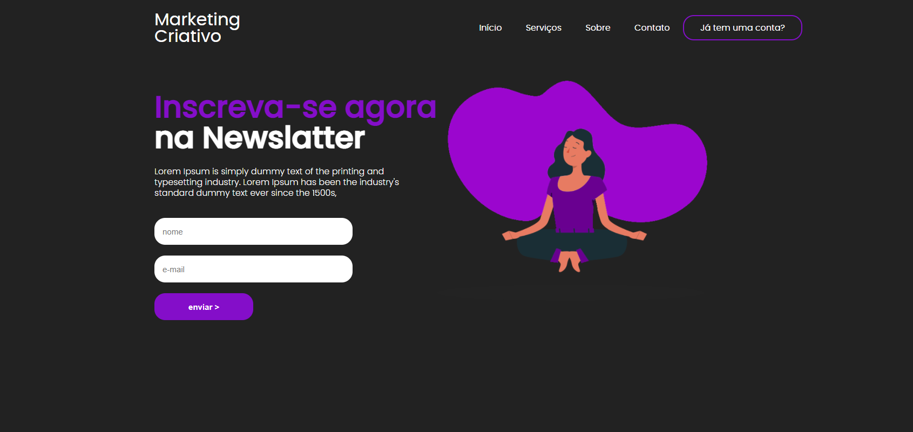
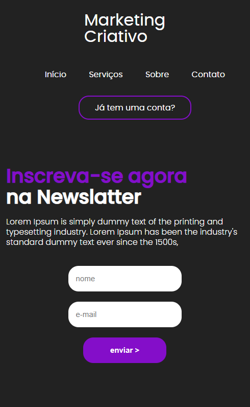

<h1 align="center">
    <a href="#">Marketing criativo</a>
</h1>

🚀 Landing page create with HTML and CSS.

  

🛠🚀 desktop view:

🛠 🚀 mobile view:

### 🛠 Technology

The following tools were used in the construction of the landig page:

- [HTML](https://developer.mozilla.org/pt-BR/docs/Web/HTML/)
- [CSS](https://developer.mozilla.org/pt-BR/docs/Web/CSS/)

### License 📝

This project is under the MIT license. See the [LICENSE](https://github.com/AnaMickaelly/form-react/blob/master/LICENSE) for more information.
